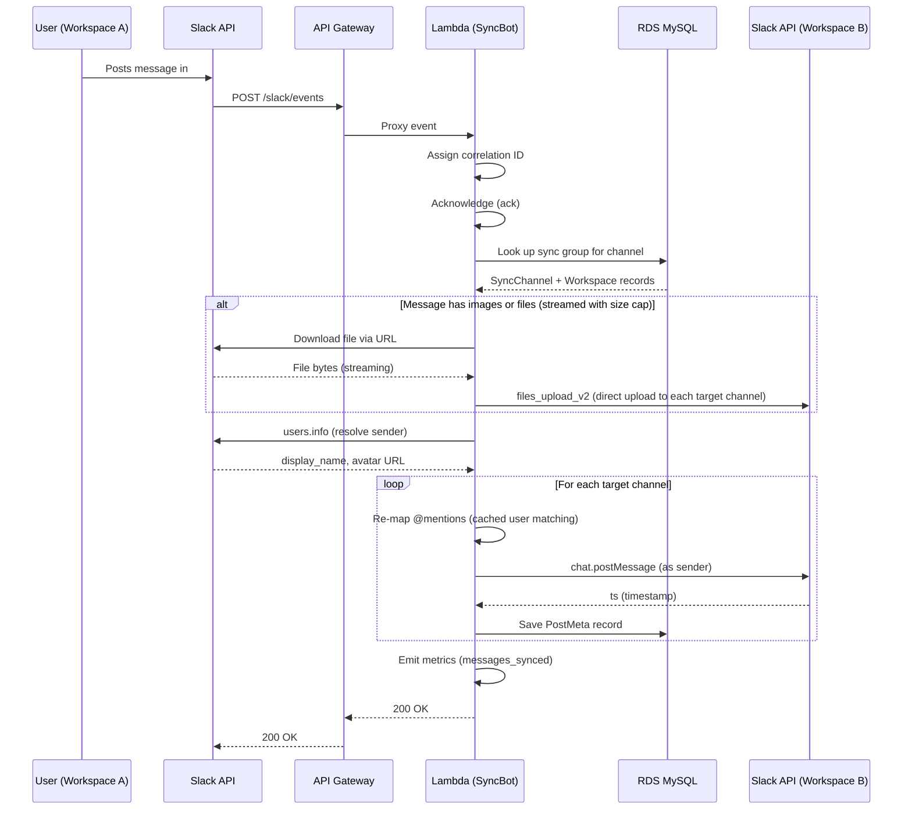
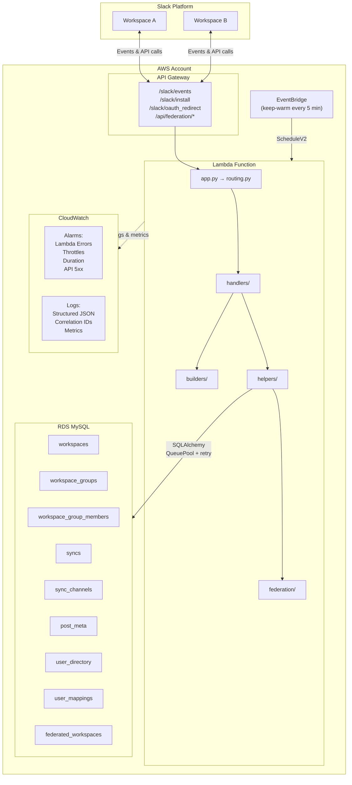

# Architecture

## Module Overview

SyncBot is organized into five top-level packages inside `syncbot/`:

| Package | Responsibility |
|---------|----------------|
| `handlers/` | Slack event and action handlers (messages, groups, channel sync, users, tokens, federation UI, backup/restore, data migration) |
| `builders/` | Slack UI construction — Home tab, modals, and forms |
| `helpers/` | Business logic, Slack API wrappers, encryption, file handling, user matching, caching, export/import (backup dump/restore, migration build/import) |
| `federation/` | Cross-instance sync — Ed25519 signing/verification, HTTP client, API endpoint handlers, pair payload (optional team_id/workspace_name for Instance A detection) (opt-in) |
| `db/` | SQLAlchemy engine, session management, `DbManager` CRUD helper, ORM models |
| `slack/` | Block Kit abstractions — action/callback ID constants, form definitions, ORM elements |

Top-level modules: `app.py` (entry point), `routing.py` (event dispatcher), `constants.py` (env-var names), `logger.py` (structured logging + metrics).

## Message Sync Flow

When a user posts a message in a synced channel, SyncBot replicates it to every other channel in the Sync group:

The same pattern applies to edits (`chat.update`), deletes (`chat.delete`), thread replies (with `thread_ts`), and reactions (threaded reply with emoji attribution).

## AWS Infrastructure

All infrastructure is defined in `template.yaml` (AWS SAM). Dashed lines indicate resources that are conditionally created — when `Existing*` parameters are set, those resources are skipped.

## Security & Hardening

| Layer | Protection |
|-------|------------|
| **Input** | File count caps (20), mention caps (50), federation user caps (5,000), federation body size limit (1 MB), `_sanitize_text` on form input |
| **Downloads** | Streaming with 30s timeout, 100 MB size cap, 8 KB chunks — prevents unbounded memory/disk usage |
| **Encryption** | Bot tokens encrypted at rest with Fernet (PBKDF2-derived key, cached to avoid repeated 600K iterations) |
| **Database** | `pool_pre_ping=True` for stale connection detection, retry decorator on all operations, `dispose()` only after all retries exhausted |
| **Slack API** | `slack_retry` decorator with exponential backoff, `Retry-After` header support, user profile caching |
| **Network** | RDS SSL/TLS enforcement, API Gateway throttling (20 burst / 10 sustained), federation HMAC-SHA256 signing with 5-minute replay window |
| **Authorization** | Admin/owner checks on all configuration actions, configurable via `REQUIRE_ADMIN` |

## Performance & Cost (Home and User Mapping Refresh)

To keep RDS and Slack API usage low when admins use the **Refresh** button on the Home tab or User Mapping screen:

- **Content hash** — A minimal set of DB queries computes a hash of the data that drives the view (groups, members, syncs, pending invites; for User Mapping, mapping ids and methods). If the hash matches the last full refresh, the app skips expensive work.
- **Cached built blocks** — After a full refresh, the built Block Kit payload is cached (keyed by workspace and user). When the hash matches, the app re-publishes that cached view with one `views.publish` instead of re-running all DB and Slack calls.
- **60-second cooldown** — If the user clicks Refresh again within 60 seconds and the hash is unchanged, the app re-publishes the cached view with a message: "No new data. Wait __ seconds before refreshing again." (seconds remaining from the last refresh). This avoids redundant full refreshes from repeated clicks.
- **Request-scoped caching** — Within a single Lambda invocation, `get_workspace_by_id` and `get_admin_ids` use the request `context` as a cache so repeated lookups for the same workspace or admin list do not hit the DB or Slack again. The same context is passed through all "push refresh" paths (e.g. when one workspace publishes a channel and other workspaces' Home tabs are updated), so those updates share the cache and stay lightweight.

## Backup, Restore, and Data Migration

- **Full-instance backup** — All tables are dumped as plain JSON (no compression). The payload includes `version`, `exported_at`, `encryption_key_hash` (SHA-256 of `PASSWORD_ENCRYPT_KEY`), and `hmac` (HMAC-SHA256 over canonical JSON). Restore inserts rows in FK order; it is intended for an empty or fresh database (e.g. after an AWS rebuild). On HMAC or encryption-key mismatch, the UI warns but allows proceeding. After restore, Home tab caches (`home_tab_hash`, `home_tab_blocks`) are invalidated for all restored workspaces.
- **Data migration (workspace-scoped)** — Export produces a JSON file with syncs, sync channels, post meta, user directory, and user mappings keyed by stable identifiers (team_id, sync title, channel_id). The export can include `source_instance` (webhook_url, instance_id, public_key, one-time connection code) so import on the new instance can establish the federation connection and then import in one step. The payload is signed with the instance Ed25519 key; import verifies the signature and warns (but does not block) on mismatch. Import uses replace mode: existing SyncChannels and PostMeta for that workspace in the federated group are removed, then data from the file is created. User mappings are imported where both source and target workspace exist on the new instance. After import, Home tab caches for that workspace are invalidated.
- **Instance A detection** — When instance B connects to A via federation, B can send optional `team_id` and `workspace_name` in the pair request. A stores them on the `federated_workspaces` row (`primary_team_id`, `primary_workspace_name`) and, if a local workspace with that `team_id` exists, soft-deletes it so the only representation of that workspace on A is the federated connection.
