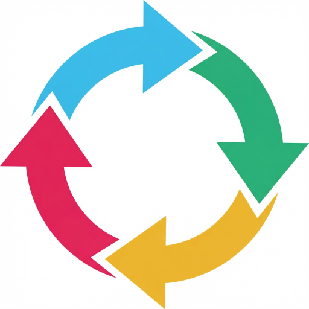

# SyncBot


SyncBot is a Slack app originally developed for the [F3 Community](https://github.com/F3Nation-Community/syncbot) and has been forked here for general use by other Slack Workspace admins. It provides a replication ("Sync") service for messages and replies across Slack Workspaces on the free tier. Once configured, messages, threads, edits, deletes, reactions, images, videos, and GIFs are automatically mirrored to every channel in a Sync group.

> **New to SyncBot?** See the [User Guide](docs/USER_GUIDE.md) for a walkthrough of all features.

---

## Create a Slack App

Before deploying (or developing locally) you need a Slack app:

1. Go to [api.slack.com/apps](https://api.slack.com/apps) and click **Create New App** → **From an app manifest**
2. Select your workspace, then paste the contents of [`slack-manifest.yaml`](slack-manifest.yaml)
3. After creating the app, upload the icon from [`assets/icon.png`](assets/icon.png) on the **Basic Information** page under **Display Information**
4. Note these values — you'll need them for deploy and/or local development:

| Where to find it | Value | Used for |
|-------------------|-------|----------|
| Basic Information → **App Credentials** | Signing Secret | Production deploy |
| Basic Information → **App Credentials** | Client ID, Client Secret | Production deploy (OAuth) |
| **OAuth & Permissions** → **Install to Workspace** → Install, then copy | Bot User OAuth Token (`xoxb-...`) | **Local development** |

5. After your first deploy, come back and replace the placeholder URLs in the app settings with your actual API Gateway endpoint (shown in the CloudFormation stack outputs)

> **Why do I need to install the app manually for local dev?** In production, SyncBot uses OAuth so each workspace gets its own token automatically. In local development mode, there's no OAuth flow — you connect to a single workspace using a bot token you copy from the Slack app settings.

---

## Deploying to AWS

SyncBot ships with a full AWS SAM template (`template.yaml`) that provisions everything on the **free tier**:

| Resource | Service | Free-Tier Detail |
|----------|---------|-----------------|
| Compute | Lambda (128 MB) | 1M requests/month free |
| API | API Gateway v1 | 1M calls/month free |
| Database | RDS MySQL (db.t3.micro) | 750 hrs/month free (12 months) |

OAuth and app data are stored in RDS. Media is uploaded directly to Slack (no runtime S3). SAM deploy uses an S3 artifact bucket for packaging only.

### Prerequisites

| Tool | Version | Purpose |
|------|---------|---------|
| **AWS SAM CLI** | latest | Build & deploy Lambda + infra |
| **Docker** | latest | SAM uses a container to build the Lambda package |
| **MySQL client** *(optional)* | any | Run schema scripts against the DB |

### First-Time Deploy

1. **Build** the Lambda package:

```bash
sam build --use-container
```

2. **Deploy** with guided prompts:

```bash
sam deploy --guided
```

You'll be prompted for parameters like `DatabaseUser`, `DatabasePassword`, `SlackSigningSecret`, `SlackClientId`, `SlackClientSecret`, `EncryptionKey`, and `AllowedDBCidr`. These are stored as CloudFormation parameters (secrets use `NoEcho`).

3. **Initialize the database** — after the stack creates the RDS instance, grab the endpoint from the CloudFormation outputs and run:

```bash
mysql -h <RDS_ENDPOINT> -u <DB_USER> -p<DB_PASSWORD> syncbot < db/init.sql
```

4. **Update your Slack app URLs** to point at the API Gateway endpoint shown in the stack outputs (e.g., `https://xxxxx.execute-api.us-east-2.amazonaws.com/Prod/slack/events`).

### Subsequent Deploys

```bash
sam build --use-container
sam deploy                        # staging (default profile)
sam deploy --config-env prod      # production profile
```

The `samconfig.toml` file stores per-environment settings so you don't have to re-enter parameters.

> For shared infrastructure, CI/CD setup, and advanced deployment options, see [docs/DEPLOYMENT.md](docs/DEPLOYMENT.md).

---

## Local Development

### Option A: Dev Container (recommended)

Opens the project inside a Docker container with full editor integration — IntelliSense, debugging, terminal, and linting all run in the container. No local Python or MySQL install needed.

**Prerequisites:** Docker Desktop + the [Dev Containers](https://marketplace.visualstudio.com/items?itemName=ms-vscode-remote.remote-containers) extension

#### 1. Clone the repo and create a `.env` file

```bash
git clone https://github.com/GITHUB_ORG_NAME/syncbot.git
cd syncbot
cp .env.example .env
```

Set `SLACK_BOT_TOKEN` to the `xoxb-...` token you copied from **OAuth & Permissions** after installing the app.

#### 2. Open in Dev Container

Open the project folder in your editor, then:

- Press `Cmd+Shift+P` → **Dev Containers: Reopen in Container**
- Or click the green remote indicator in the bottom-left corner → **Reopen in Container**

The first build takes a minute or two. After that, your editor is running inside the container with Python, MySQL, and all dependencies ready.

#### 3. Run the app

```bash
cd syncbot && python app.py
```

The app starts on **port 3000** (auto-forwarded to your host).

#### 4. Expose to Slack

In a **local** terminal (outside the container), start a tunnel:

```bash
cloudflared tunnel --url http://localhost:3000/
```
or
```bash
ngrok http 3000
```

Then update your Slack app's **Event Subscriptions** and **Interactivity** URLs to the public URL.

#### 5. Run tests

```bash
python -m pytest tests -v
```

#### 6. Connect to the database

```bash
mysql -h db -u root -prootpass syncbot
```

The database schema is initialized automatically on first run. To reset it, rebuild the container with **Dev Containers: Rebuild Container**.

---

### Option B: Docker Compose (without Dev Container)

Runs everything in containers but you edit files on your host.

**Prerequisites:** Docker Desktop

```bash
git clone https://github.com/GITHUB_ORG_NAME/syncbot.git
cd syncbot
cp .env.example .env          # set SLACK_BOT_TOKEN
docker compose up --build
```

The app listens on **port 3000**. Code changes require `docker compose restart app`. Only rebuild when `requirements.txt` changes.

```bash
docker compose exec app python -m pytest /app/tests -v    # run tests
docker compose exec db mysql -u root -prootpass syncbot    # database shell
docker compose down -v                                     # stop + delete DB volume
```

---

### Option C: Native Python

**Prerequisites:** Python 3.11+, Poetry 1.6+, Docker *(optional, for MySQL)*

```bash
git clone https://github.com/GITHUB_ORG_NAME/syncbot.git
cd syncbot
poetry install --with dev
```

Start a local MySQL instance:

```bash
docker run -d --name syncbot-db \
  -e MYSQL_ROOT_PASSWORD=rootpass \
  -e MYSQL_DATABASE=syncbot \
  -p 3306:3306 \
  mysql:8
mysql -h 127.0.0.1 -u root -prootpass syncbot < db/init.sql
```

Configure and run:

```bash
cp .env.example .env          # set SLACK_BOT_TOKEN + verify DATABASE_HOST=127.0.0.1
source .env
poetry run python syncbot/app.py
```

The app starts on **port 3000**. Use a tunnel to expose it to Slack. Run tests with `poetry run pytest -v`.

---

## Environment Variables

See [`.env.example`](.env.example) for all available options with descriptions.

### Always Required

| Variable | Description |
|----------|-------------|
| `DATABASE_HOST` | MySQL hostname |
| `ADMIN_DATABASE_USER` | MySQL username |
| `ADMIN_DATABASE_PASSWORD` | MySQL password |
| `ADMIN_DATABASE_SCHEMA` | MySQL database name |

### Required in Production (Lambda)

| Variable | Description |
|----------|-------------|
| `SLACK_SIGNING_SECRET` | Verifies incoming Slack requests |
| `ENV_SLACK_CLIENT_ID` | OAuth client ID |
| `ENV_SLACK_CLIENT_SECRET` | OAuth client secret |
| `ENV_SLACK_SCOPES` | Comma-separated OAuth scopes |
| `PASSWORD_ENCRYPT_KEY` | Passphrase for Fernet bot-token encryption |

OAuth state and installation data are stored in the same RDS MySQL database.

### Local Development Only

| Variable | Description |
|----------|-------------|
| `SLACK_BOT_TOKEN` | Bot token (`xoxb-...`) — presence triggers local-dev mode |
| `LOCAL_DEVELOPMENT` | Set to `true` to skip token verification and use readable logs |

### Optional

| Variable | Default | Description |
|----------|---------|-------------|
| `REQUIRE_ADMIN` | `true` | Only admins/owners can configure syncs |
| `SOFT_DELETE_RETENTION_DAYS` | `30` | Days before soft-deleted data is purged |
| `SYNCBOT_FEDERATION_ENABLED` | `false` | Enable External Connections |
| `SYNCBOT_PUBLIC_URL` | *(none)* | Public URL for external connections |
| `ENABLE_DB_RESET` | `false` | Show a "Reset Database" button on the Home tab |

---

## Further Reading

| Document | Description |
|----------|-------------|
| [User Guide](docs/USER_GUIDE.md) | End-user walkthrough of all features |
| [Architecture](ARCHITECTURE.md) | Message sync flow, AWS infrastructure, caching |
| [Backup & Migration](docs/BACKUP_AND_MIGRATION.md) | Full-instance backup/restore, workspace data migration |
| [Deployment](docs/DEPLOYMENT.md) | Shared infrastructure, CI/CD via GitHub Actions |
| [API Reference](docs/API_REFERENCE.md) | HTTP endpoints and subscribed Slack events |
| [Improvements](IMPROVEMENTS.md) | Completed and planned improvements |

## Project Structure

```
syncbot/
├── syncbot/                   # Application code (Lambda function)
│   ├── app.py                 # Entry point — Slack Bolt app + Lambda handler
│   ├── constants.py           # Env-var names, startup validation
│   ├── routing.py             # Event/action → handler dispatcher
│   ├── builders/              # Slack UI construction (Home tab, modals, forms)
│   ├── handlers/              # Slack event & action handlers
│   ├── helpers/               # Business logic, Slack API wrappers, utilities
│   ├── federation/            # Cross-instance sync (opt-in)
│   ├── db/                    # Engine, session, ORM models
│   └── slack/                 # Action IDs, forms, Block Kit helpers
├── db/init.sql                # Database schema
├── tests/                     # pytest unit tests
├── docs/                      # Extended documentation
├── template.yaml              # AWS SAM infrastructure-as-code
├── slack-manifest.yaml        # Slack app manifest
└── docker-compose.yml         # Local development stack
```

## License

This project is licensed under **AGPL-3.0**, which means you can use and modify it, just keep it open and shareable. See [LICENSE](LICENSE) for details.
